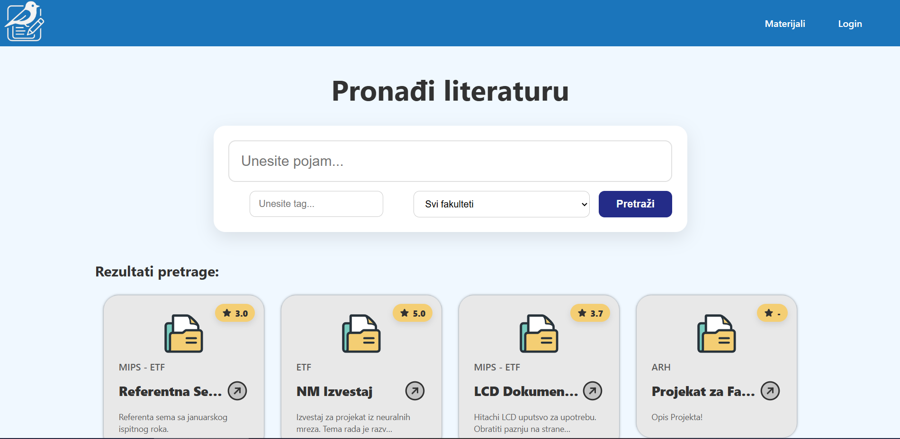
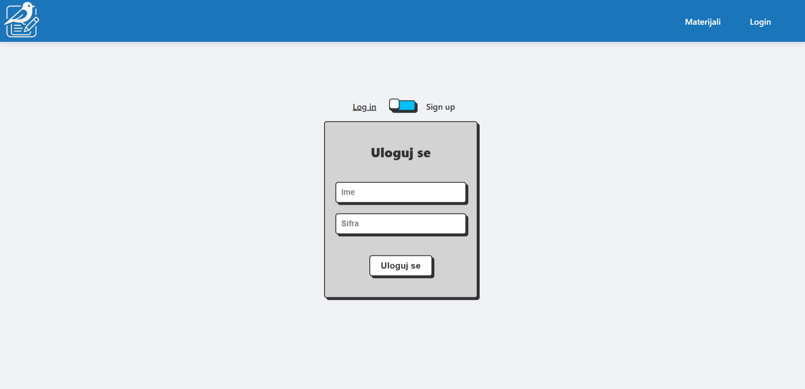
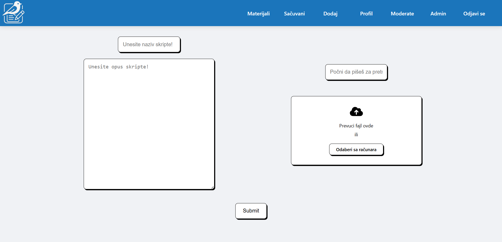
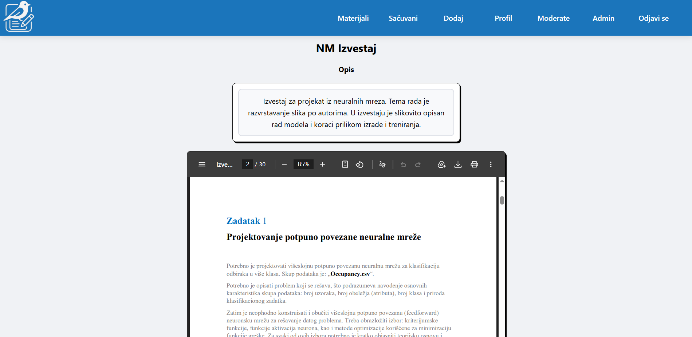
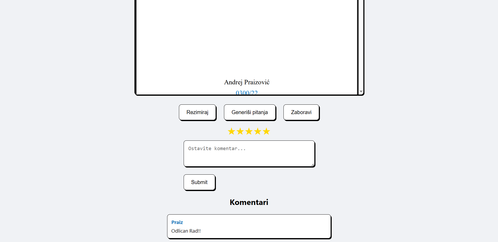
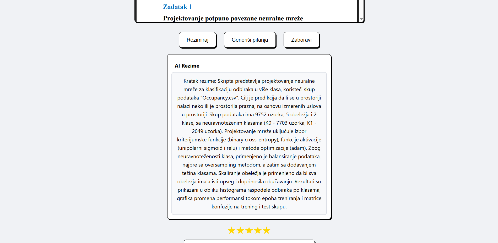
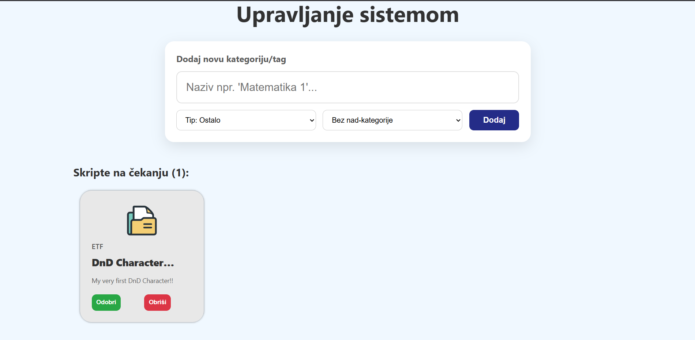

# SkriPtica 📚

**Modern platform for students to share their scripts and other materials.**

A comprehensive web application built with Django that enables students to collaborate, share educational resources, and access scripts in a centralized, organized platform.

---

## 🌟 Features

- **User Authentication**: Secure login and registration system
- **Script & Material Sharing**: Upload and share Python scripts, notes, and educational materials
- **AI-Powered Tools**: Integrated AI services for enhanced learning
- **Content Management**: Organize and browse shared materials efficiently
- **Moderation System**: Built-in content moderation and admin controls
- **User Accounts**: Personalized user profiles and management

---

## 📸 Screenshots

### Home Page

The main landing page showcasing the platform's features and navigation.

### Login & Registration

Secure user authentication interface for account creation and login.

### Add Materials

Intuitive interface for uploading and sharing new scripts and materials.

### Material Library

Browse and view detailed information about shared materials.


Explore additional material resources and descriptions.

### AI Tools

AI-powered features to assist with script analysis and learning.

### Moderation Dashboard

Admin panel for content moderation and platform management.

---

## 🛠️ Tech Stack

- **Backend**: Python (43.7%)
- **Frontend**: HTML (29.6%), CSS (23.6%), JavaScript (3.1%)
- **Framework**: Django
- **Database**: SQL-based (configured in Django settings)
- **AI Services**: Custom AI integration module

---

## 📋 Requirements

See `requirements.txt` for all Python dependencies.

Key dependencies include:
- Django
- Django REST Framework
- Additional Python packages for AI services and database management

---

## 🚀 Getting Started

### Installation

1. **Clone the repository**
   ```bash
   git clone https://github.com/kekec3/SkriPtica.git
   cd SkriPtica
   ```

2. **Install dependencies**
   ```bash
   pip install -r requirements.txt
   ```

3. **Run migrations**
   ```bash
   python manage.py migrate
   ```

4. **Start the development server**
   ```bash
   python manage.py runserver
   ```

5. **Access the application**
   Open your browser and navigate to `http://localhost:8000`

---

## 📁 Project Structure

```
SkriPtica/
├── Skriptica/              # Main Django project settings
├── accounts/               # User authentication and profile management
├── materials/              # Material sharing and management module
├── ai_services/            # AI integration and services
├── static/                 # Static files (CSS, JavaScript, images)
├── templates/              # HTML templates
├── screenshots/            # Project screenshots
├── manage.py              # Django management script
├── requirements.txt       # Python dependencies
└── .gitignore            # Git ignore rules
```

---

## 📝 Module Overview

### Accounts Module
Handles user registration, authentication, and profile management.

### Materials Module
Core module for uploading, sharing, and browsing educational materials and scripts.

### AI Services
Provides AI-powered features for script analysis and learning assistance.

### Skriptica (Main Project)
Contains Django project configuration and global settings.

---

## 🤝 Contributing

Contributions are welcome! Feel free to fork the repository and submit pull requests to improve the platform.

---

## 📧 Contact

For questions or suggestions, please reach out through GitHub issues or contact the repository owner.

---

## 📄 License

This project is open source. Please check the repository for license details.

---

**Happy sharing and learning with SkriPtica! 🎓**
